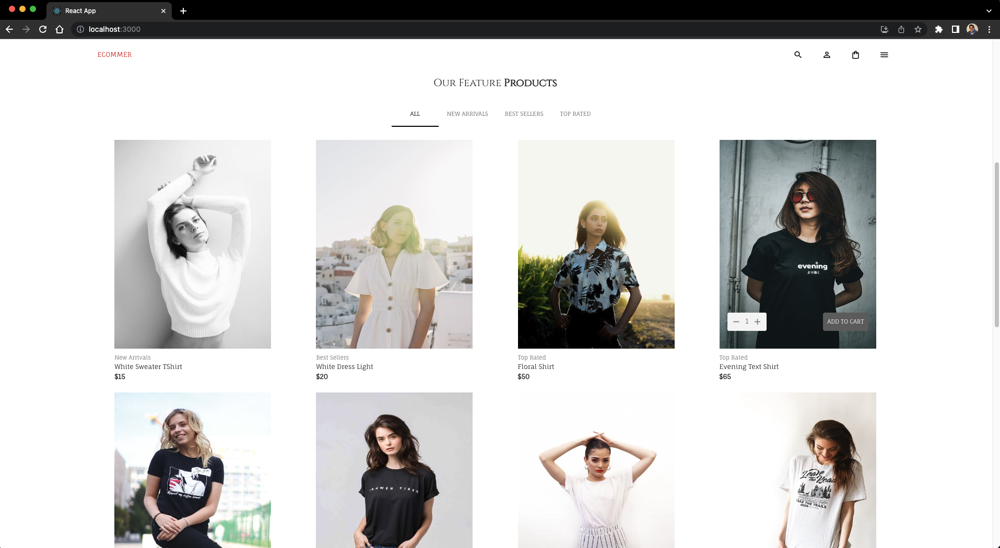
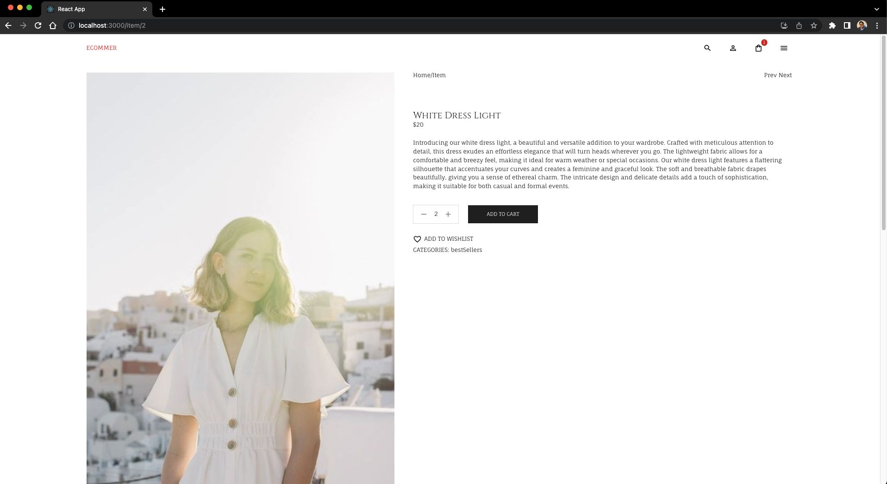
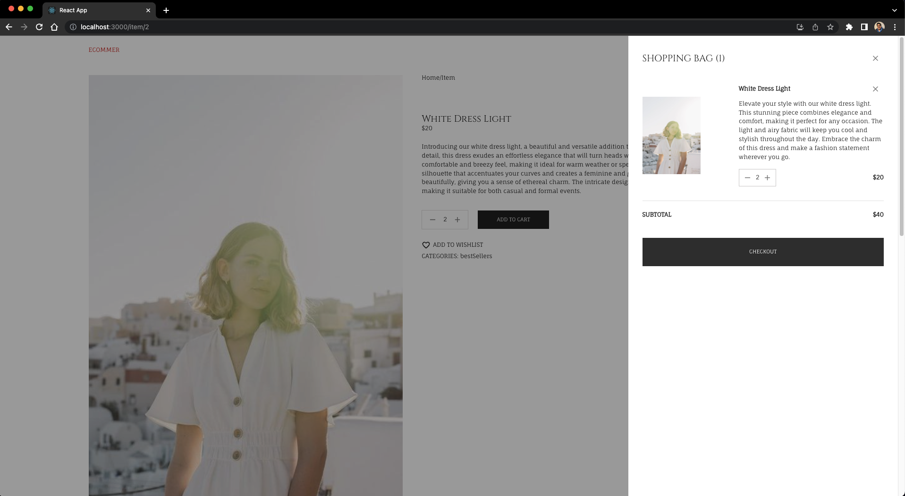
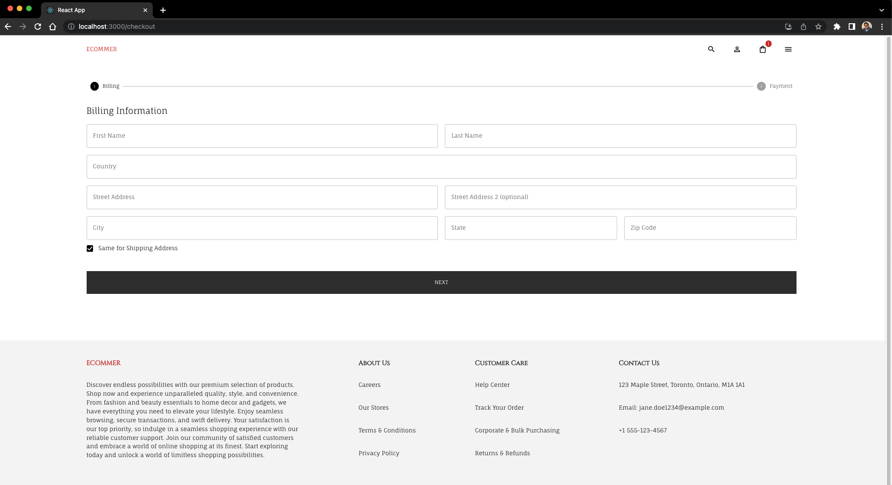
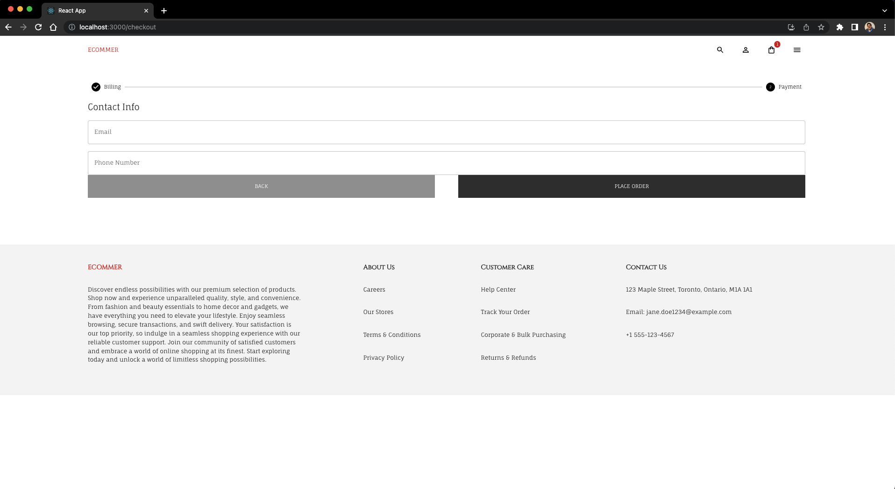
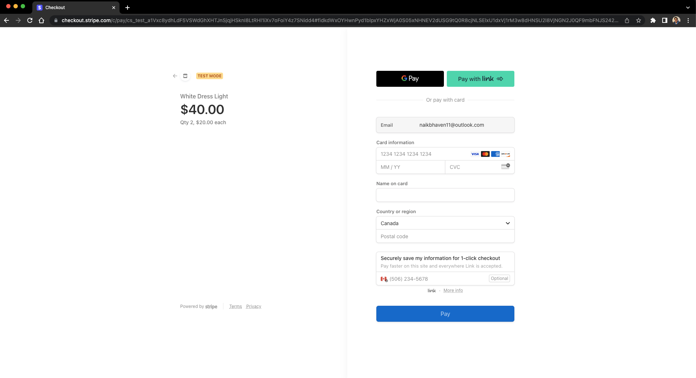
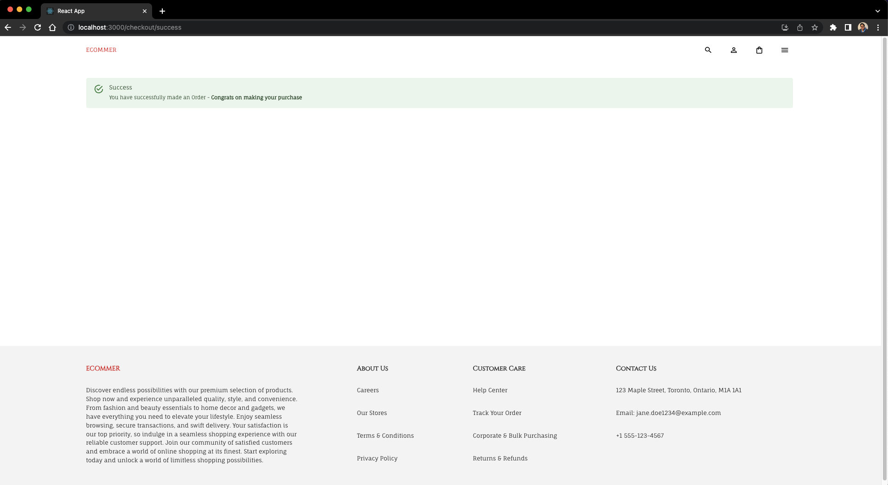

## About the Project


The React eCommerce Responsive App with Stripe and Strapi, utilizing MUI, Redux, and Docker, is a cutting-edge web application that offers a seamless online shopping experience while providing a highly efficient management system for store owners. This project harnesses the power of React, Stripe payment gateway, Strapi headless CMS, Material-UI (MUI), Redux state management, and Docker containerization to create a feature-rich and scalable eCommerce platform.

The main objective of this project is to develop a responsive and user-friendly eCommerce application using React, a widely adopted JavaScript library for building dynamic user interfaces. Leveraging React's component-based architecture, the app ensures modularity and code reusability, enabling the creation of a scalable and easily maintainable application.

Integration with Stripe, one of the leading online payment gateways, allows customers to securely complete transactions using a variety of payment methods, including credit cards, debit cards, and digital wallets. Stripe's robust features, such as secure payment processing, subscription management, and refunds, provide a reliable and secure payment infrastructure for the eCommerce app.

To manage the backend and content of the eCommerce platform, Strapi, a headless CMS, is employed. Strapi offers a flexible and customizable admin panel, empowering store owners to efficiently manage products, inventory, orders, and customer data. Strapi's intuitive interface and powerful APIs enable seamless control and organization of the eCommerce store's content and configuration.

The project also incorporates Material-UI (MUI), a popular React UI framework that provides a rich set of customizable and responsive UI components. MUI enables the development of a visually appealing and consistent user interface, ensuring an enhanced user experience throughout the eCommerce app.

Redux, a state management library, is utilized to efficiently manage application state and facilitate data flow between React components. By implementing Redux, the app ensures a centralized and predictable state management approach, simplifying the handling of complex data interactions and improving overall app performance.

To achieve efficient deployment and portability, the project utilizes Docker, a containerization platform. Docker enables the frontend and backend components to be containerized together, allowing for streamlined deployment and simplified management of the application's environment. With Docker, the app can be easily deployed across different platforms and environments, ensuring consistent functionality and eliminating potential compatibility issues.

### Key Features:

1. Responsive Design: The eCommerce app is designed to be responsive, delivering an optimal shopping experience across various devices, including desktops, tablets, and mobile devices.
2. Product Catalog: The app showcases products with visually appealing layouts, detailed descriptions, pricing information, and multiple product images.
3. Shopping Cart and Checkout: Customers can add products to their cart, review their selections, and proceed to a secure checkout process powered by Stripe, ensuring seamless and secure transactions.
4. Payment Processing: Integration with the Stripe payment gateway enables customers to make payments using various methods, ensuring a smooth and secure payment experience.
5. User Authentication and Account Management: The app allows users to create accounts, securely log in, and manage their profile information, order history, and saved addresses.
6. Order Management: The app provides an intuitive interface for store owners to manage and track orders, process shipments, and efficiently handle returns or refunds.
7. Content Management: Strapi serves as the headless CMS, allowing store owners to effortlessly manage products, categories, images, and other content on the eCommerce platform.
8. Material-UI (MUI) Integration: The app leverages MUI's extensive library of customizable and responsive UI components, enabling the creation of visually appealing and consistent user interfaces.
9. Redux State Management: Redux facilitates efficient application state management and data flow between components, ensuring a predictable and scalable approach to handling complex data interactions.
10. Docker Containerization: The use of Docker allows for the containerization of the frontend and backend components together, simplifying deployment, ensuring portability, and enhancing the management of the application's environment.

By combining the power of React, Stripe, Strapi, MUI, Redux, and Docker, this eCommerce app provides a comprehensive solution for building a successful and scalable online store. Whether you are a small business owner or an enterprise-level organization, this solution offers the flexibility, functionality, and portability required to create a dynamic and profitable eCommerce platform.

### Built With

- [](https://stripe.com/docs/billing/quickstart)
- [](https://docs.strapi.io/dev-docs/quick-start)
- [](https://reactjs.org/)
- [](https://nodejs.org/en/download)
- [](https://www.docker.com/)
- [](https://mui.com/)
- [](https://redux-toolkit.js.org/introduction/getting-started)

## Getting Started

### Prerequisites

To run this project, you will need:

- Node.js installed on your development machine. To install [Node.js](https://nodejs.org/en/download), follow the link. By having Node.js installed you will also have npm installed.
- Any editor of your choice. Personally, I use [Visual Studio Code](https://code.visualstudio.com/download) for all my projects.

### Installation

1. Clone the repo

   ```markdown
   git clone https://github.com/bhaven123/fullstack-react-ecommerce-stripe
   ```

2. Install NPM packages

   ```markdown
   npm install
   ```

3. To make sure the server is working properly, first create its project folder structure using the Strapi CLI in a terminal window and then enter your Stripe API secret key in an `.env` file. Also, make sure to enter the Stripe API Public key in the `Checkout.jsx` file in the client folder.

   ```javascript
   const stripePromise = loadStripe("Your public key");
   ```

   ```javascript
   const STRIPE_SECRET_KEY = "Your MongoDB connection string";
   const JWT_SECRET = "Secure Token String for Authentication";
   const PORT = "Port you wish to run the strapi server on";
   ```

## Usage

- To run the application with Docker, have your docker daemon running. Then, simply type the following command in a terminal inside the project root folder which has the `docker-compose.yml` file.

  ```
  docker compose up -d
  ```

- To stop the application, type the following command.

  ```
  docker compose down
  ```

### Screenshots















## Contact

- Bhaven Naik - [naikbhaven11@gmail.com](mailto:naikbhaven11@gmail.com) | Portfolio - [https://bhaven-naik.com/](https://bhaven-naik.com/)
- Project Link: [https://github.com/bhaven123/fullstack-react-ecommerce-stripe](https://github.com/bhaven123/fullstack-react-ecommerce-stripe)

## Acknowledgments

- [Create a New React Project](https://create-react-app.dev/docs/getting-started/)
- [React Router](https://reactrouter.com/en/v6.3.0/getting-started/installation)
- [React Responsive Carousel](https://github.com/leandrowd/react-responsive-carousel)
- [Axios](https://axios-http.com/)
- [Visual Studio Code](https://code.visualstudio.com/download)
- [Dotenv](https://github.com/motdotla/dotenv)
- [JWT (JasonWebToken)](https://github.com/auth0/node-jsonwebtoken)
- [Google Fonts](https://fonts.google.com/)
- [Formik](https://formik.org/docs/overview)
- [Yup](https://github.com/jquense/yup)
- [EdRoh Tutorial - https://www.youtube.com/watch?v=EBCdyQ_HFMo]()
